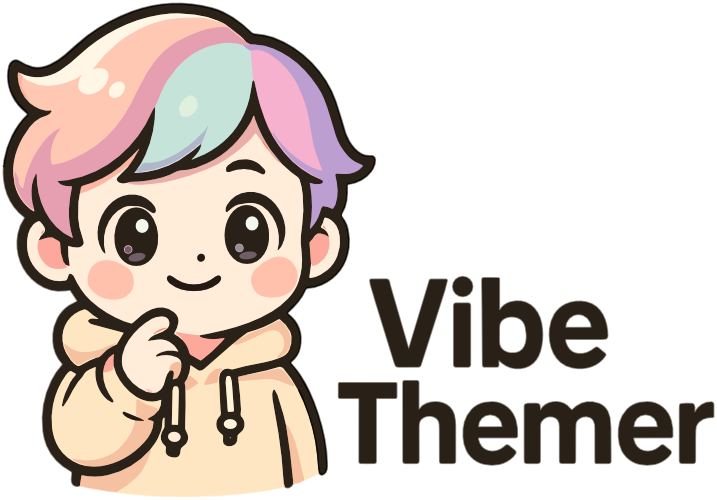

  

*Love Vibe Themer? Consider sponsoring its development! Your support helps maintain this project and enables new features that make coding even more delightful.* ✨

---

🎨 Transform your VS Code experience with AI-generated themes! Describe your vibe in natural language and watch as OpenAI creates a beautiful, cohesive color theme tailored to your mood.

> **⚠️ IMPORTANT**: Generated themes override your current theme settings. Always use the **"Reset Theme Customizations"** command when you want to return to your original theme.

> **🤖 NEAT FACT**: This entire extension was 100% vibe-coded using VS Code's agentic AI mode—not a single manual edit, including this README and the custom Copilot instruction files! The logo is also generated using OpenAI's latest image generation model. This project started as an experiment to see how far pure AI-driven development can be pushed with current model capabilities.

---

## ✨ Features

- **🤖 AI-powered theme generation**: Describe your vibe (e.g., "cozy autumn evening", "cyberpunk neon", "calm ocean depths") and instantly get a matching color palette
- **🎯 Real-time streaming**: Watch your theme apply live as AI generates each color setting 
- **🌈 Comprehensive coverage**: Updates 80-150+ settings across all major UI elements—editor, activity bar, sidebar, status bar, tabs, panels, terminal, and more
- **💻 Smart syntax highlighting**: AI generates matching token colors for beautiful code syntax highlighting
- **🔐 Secure API storage**: Your OpenAI API key is stored securely in VS Code's encrypted storage
- **⚙️ Flexible model selection**: Choose which OpenAI model to use for theme generation
- **🔄 Easy reset**: Instantly clear all customizations and return to your default theme

## Requirements

- A valid OpenAI API key ([get one here](https://platform.openai.com/))
- Visual Studio Code 1.68.0 or higher
- Internet connection (for OpenAI API access)

## 🚀 Quick Start

1. **Install** Vibe Themer from the VS Code Marketplace
2. **Generate your first theme**: 
   - Open Command Palette (`Cmd+Shift+P` / `Ctrl+Shift+P`)
   - Run **"Vibe Themer: Change Theme"**
   - Enter your OpenAI API key when prompted (stored securely, only needed once)
   - Describe your ideal theme: `"warm sunset over mountains"`, `"minimal dark forest"`, or `"vibrant retro 80s"`
3. **Watch the magic**: Your theme applies in real-time as AI generates each color setting
4. **Want to change back?**: Always use **"Vibe Themer: Reset Theme Customizations"** to return to your original theme

> **💡 Pro tip**: Be descriptive! Instead of "dark theme", try "mysterious midnight with purple accents" for better results.

## 📋 Commands

| Command                                   | Description                                                  |
| ----------------------------------------- | ------------------------------------------------------------ |
| **Vibe Themer: Change Theme**               | 🎨 Generate a new AI theme from your description              |
| **Vibe Themer: Reset Theme Customizations** | 🔄 **Important:** Remove generated theme and restore defaults |
| **Vibe Themer: Clear OpenAI API Key**       | 🔑 Remove your stored API key                                 |
| **Vibe Themer: Select OpenAI Model**        | ⚙️ Choose which AI model to use (GPT-4, GPT-3.5, etc.)        |
| **Vibe Themer: Reset Model Selection**      | 🔧 Reset to default AI model                                  |

## ⚠️ Theme Management

**IMPORTANT**: Vibe Themer works by overriding VS Code's color settings. This means:

- ✅ **Generated themes** apply on top of your current theme
- ⚠️ **Theme changes persist** until manually removed
- 🔄 **Always use "Reset Theme Customizations"** to return to your original theme
- 🚫 **Simply changing themes in VS Code settings won't remove Vibe Themer customizations**

To switch back to your original theme or try a different base theme:
1. Run **"Vibe Themer: Reset Theme Customizations"** first
2. Then change to your desired theme in VS Code settings
3. Generate a new Vibe Themer theme if desired

## 🛠️ How It Works

1. **You describe your vibe**: Use natural language to describe your ideal theme
2. **AI processes your request**: Your description is sent to OpenAI for intelligent color palette generation
3. **Real-time theme application**: Watch as 80-150+ individual color settings apply to your editor in real-time
4. **Comprehensive styling**: Every UI element gets styled—from editor background to syntax highlighting to button colors
5. **Persistent customization**: Your theme stays applied until you reset it using the provided command

## 🔒 Privacy & Security

- 🔐 **API Key Security**: Your OpenAI API key is stored in VS Code's encrypted secret storage
- 📝 **Data Usage**: Only your theme descriptions are sent to OpenAI for processing
- 🚫 **No Collection**: No personal data, code, or usage analytics are collected or transmitted
- 🔄 **Full Control**: Clear your API key anytime with the provided command

> **⚠️ CONTENT DISCLAIMER**: Vibe Themer uses OpenAI's API to generate theme descriptions and progress messages. The extension does not filter or moderate AI-generated text content. While the extension is designed for theme generation, users are responsible for their input prompts. The extension author is not responsible for any inappropriate, offensive, or unexpected content that may be generated by the AI model in response to user inputs.

## ⚙️ Requirements

- ✅ Visual Studio Code 1.68.0 or higher
- 🔑 Valid OpenAI API key ([get one here](https://platform.openai.com/))
- 🌐 Internet connection for OpenAI API access

## 🐛 Known Issues & Tips

- **Internet Required**: Active connection needed for OpenAI API access
- **Theme Quality**: More descriptive prompts yield better themes (try "warm autumn forest with golden highlights" vs just "autumn")
- **Performance**: Large themes (150+ settings) may take 30-60 seconds to generate completely
- **Workspace vs Global**: When no workspace is open, themes apply to global user settings
- **Model Differences**: GPT-4 typically produces more sophisticated color schemes than GPT-3.5

## 🤖 About This Project

**Vibe Themer represents a fascinating experiment in AI-driven development.** This entire extension—every line of code, documentation, architecture decisions, and feature implementations—was crafted using VS Code's agentic AI mode. Not a single manual edit was made.

This project started as a challenge: **How far can pure AI-driven "vibe coding" be pushed with current model capabilities?** The result is a fully functional, polished VS Code extension that demonstrates the remarkable potential of AI-assisted development when given the right tools and context.

**Key Development Facts:**
- 🤖 **100% AI-authored**: Every function, type definition, and architectural pattern
- 🎯 **Zero manual edits**: All code generation happened through natural language prompts
- 🏗️ **Complex architecture**: Functional programming patterns, domain-driven design, and clean abstractions
- 🔄 **Iterative refinement**: Multiple rounds of AI-guided improvements and polish
- 📚 **Comprehensive features**: From streaming API integration to secure credential management

*Vibe Themer proves that AI can create sophisticated, production-ready software when provided with clear requirements and iterative feedback.*

---

## 🎨 Ready to Transform Your Coding Experience?

**Start creating your perfect coding atmosphere today!**

*Remember: Always use "Reset Theme Customizations" when you want to return to your original theme setup.*
